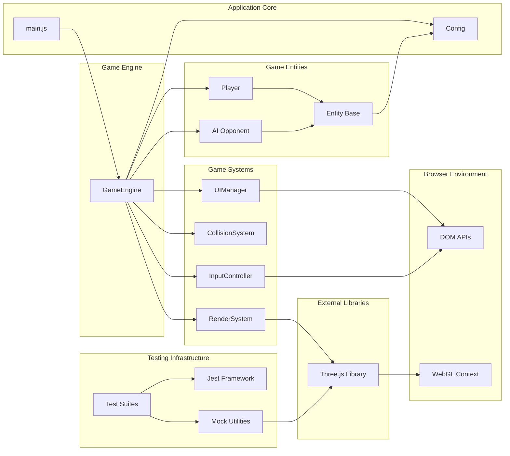
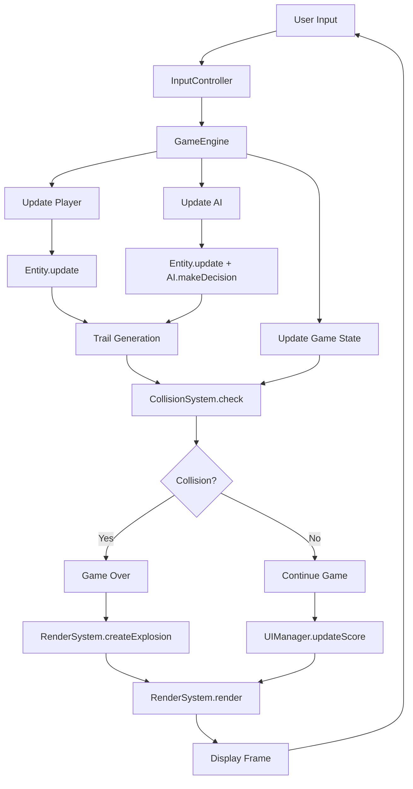
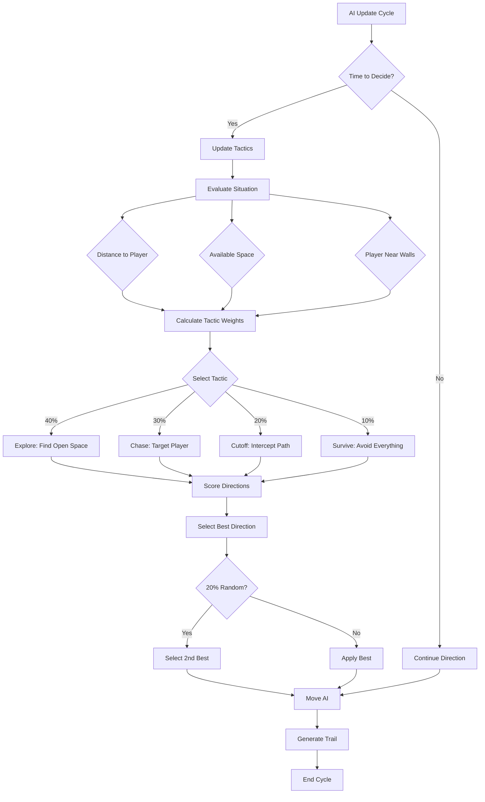
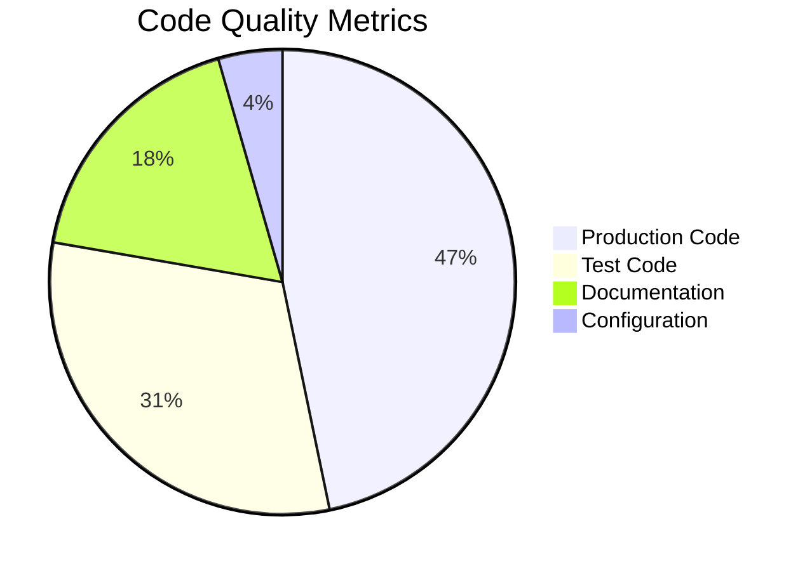
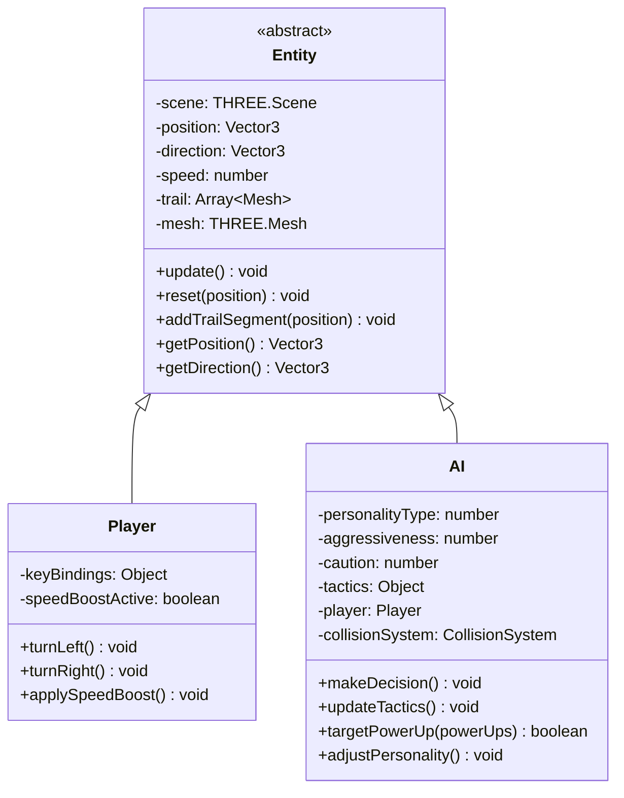
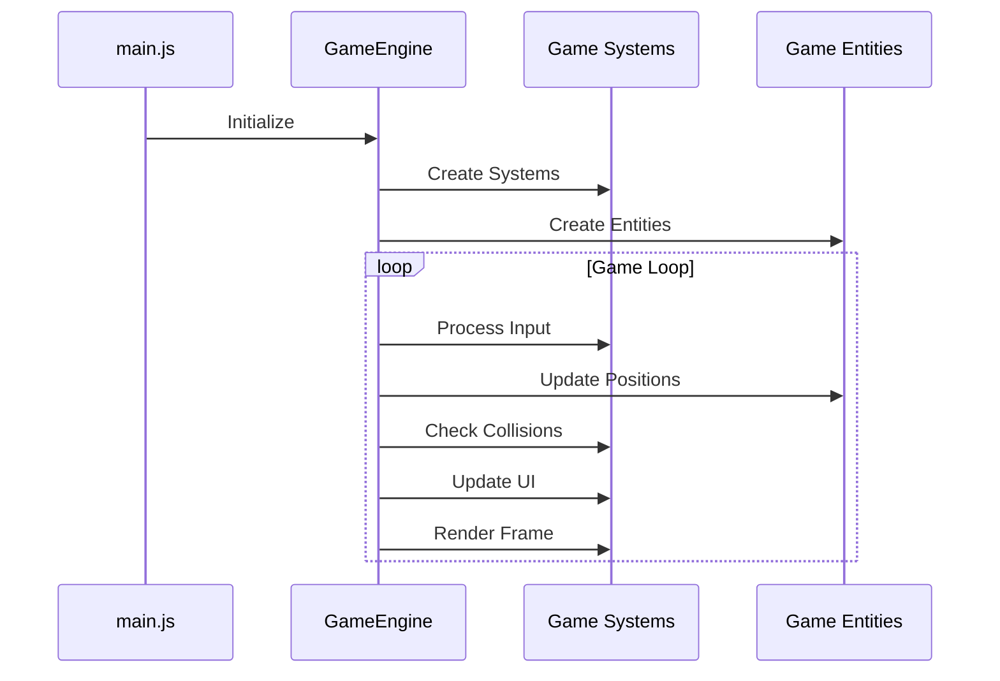
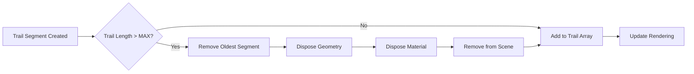
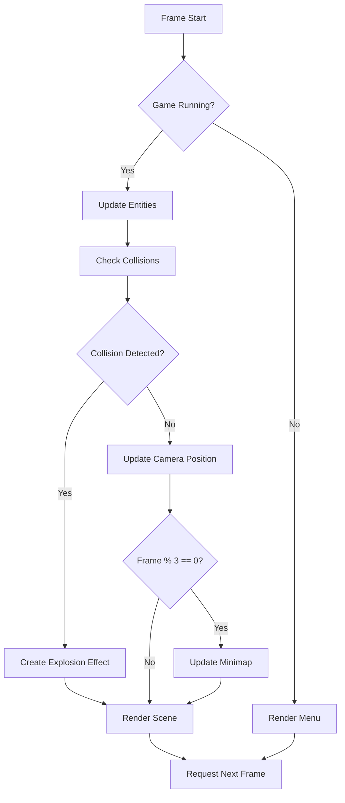
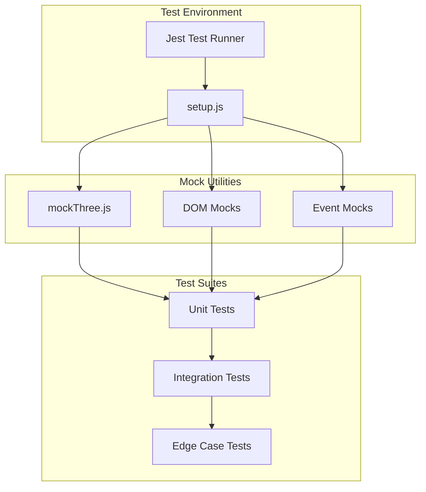
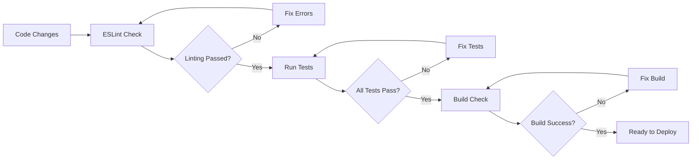

# Tron3D Architecture & Quality Documentation

## System Overview

Tron3D is built using a modular, class-based architecture with clear separation of concerns and comprehensive testing coverage.

## Architecture Diagrams

### Component Dependency Graph

### Data Flow Architecture

### AI Decision Tree

## Code Quality Metrics

### Test Coverage Summary

| Component | Test File | Lines of Code | Test Cases | Coverage Focus |
|-----------|-----------|---------------|------------|----------------|
| **Entity System** | Entity.test.js | 260 lines | 6 tests | Position, trail generation, reset |
| **Player Controls** | Player.test.js | 87 lines | 5 tests | Movement, turning, speed boosts |
| **AI Intelligence** | AI.test.js | 261 lines | 14 tests | Decision making, tactics, personalities |
| **Collision Detection** | CollisionSystem.test.js | 148 lines | 8 tests | Wall/trail/entity collisions |
| **Trail Mechanics** | TrailCollision.test.js | 139 lines | 6 tests | Trail collision edge cases |
| **Rendering System** | RenderSystem.test.js | 118 lines | 4 tests | Camera, explosions, rendering |
| **Input Handling** | InputController.test.js | 159 lines | 8 tests | Keyboard/touch input processing |
| **UI Management** | UIManager.test.js | 152 lines | 9 tests | DOM manipulation, minimap |
| **Game Engine** | GameEngine.test.js | 68 lines | 4 tests | Game state, difficulty, scoring |

**Total: 9 test suites, 64+ test cases, 1,392 lines of test code**

### Code Quality Standards

#### ESLint Compliance
- **Zero linting errors** across all source files
- **Consistent code style** with standardized indentation and formatting
- **No unused variables** or dead code
- **Proper error handling** maintained throughout

#### Testing Strategy
- **Unit Tests**: Individual component functionality
- **Integration Tests**: System interaction validation  
- **Mock Strategy**: Comprehensive Three.js and DOM mocking
- **Edge Case Coverage**: Boundary conditions and error states

#### Performance Benchmarks
- **60 FPS target**: Maintained across all supported devices
- **Memory management**: Automatic cleanup of trails and particles
- **Rendering optimization**: Selective update frequencies
- **AI efficiency**: Configurable decision-making intervals

## Implementation Patterns

### Entity-Component Pattern

### System Coordination Pattern

## Performance Optimizations

### Memory Management

### Rendering Pipeline

## Testing Infrastructure

### Mock Architecture

### Quality Gates

## Future Architecture Considerations

### Scalability Planning

**Component System Migration**:
- Transition from inheritance to composition
- Entity-Component-System (ECS) architecture
- Better separation of data and behavior

**State Management**:
- Centralized state management (Redux-like)
- Immutable state updates
- Time-travel debugging capabilities

**Networking Architecture**:
- WebRTC peer-to-peer multiplayer
- Client-side prediction
- Server reconciliation

### Technical Debt

**Priority Improvements**:
1. **TypeScript Migration**: Enhanced type safety
2. **Build System Modernization**: Vite for faster builds
3. **Asset Pipeline**: Optimized loading and caching
4. **Performance Monitoring**: Real-time metrics collection

---

*This documentation reflects the current state of the Tron3D codebase as of the latest quality improvements and architectural refinements.*