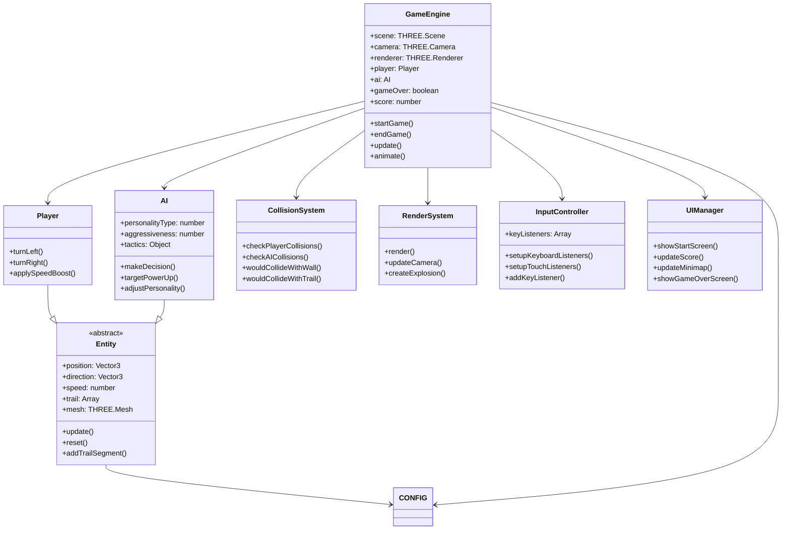
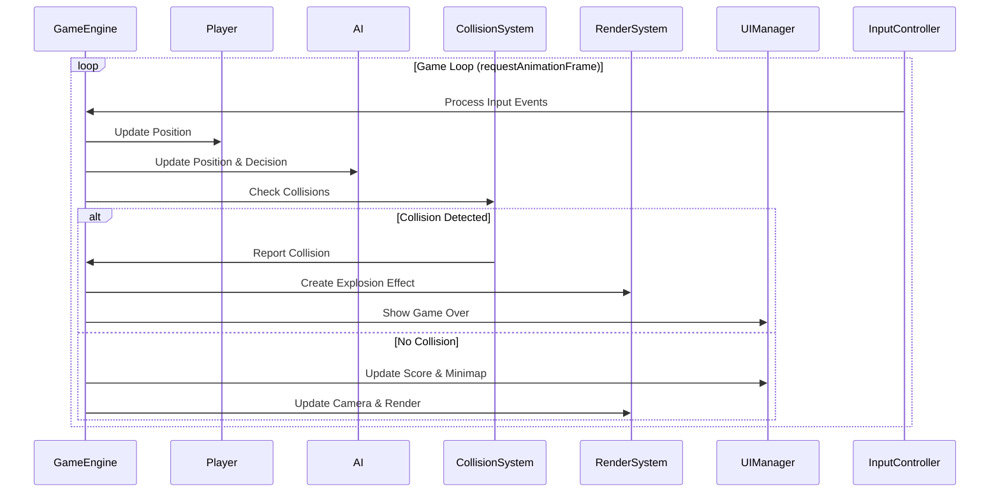
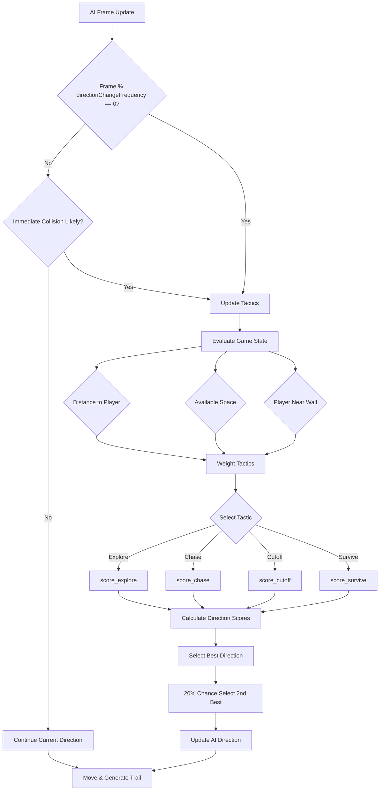

# CLAUDE.md

This file provides guidance to Claude Code (claude.ai/code) when working with code in this repository.

## Project Overview

Tron3D is a 3D third-person Tron light cycles game that runs in a web browser. It uses Three.js for 3D graphics rendering and is built with HTML, CSS, and JavaScript (ES6 modules). The game features a player-controlled light cycle racing against an AI opponent, both leaving light trails behind that cause crashes when hit.

## Code Architecture

The codebase is organized using a modular, class-based architecture with clear separation of concerns:



### Core Components

#### Core
- **`GameEngine`**: Main game controller that manages the game loop, state, and coordinates all systems
- **`Config`**: Central configuration settings and game constants

#### Entities
- **`Entity`**: Base class for game objects with common properties (position, direction, speed, trail management)
- **`Player`**: Player-controlled light cycle with input handling and special abilities
- **`AI`**: Computer-controlled opponent with sophisticated decision-making logic

#### Systems
- **`CollisionSystem`**: Handles all collision detection (walls, trails, entities)
- **`RenderSystem`**: Manages Three.js rendering, camera positioning, and visual effects
- **`InputController`**: Processes keyboard and touch inputs with event management
- **`UIManager`**: Handles DOM-based UI elements and HUD updates

#### Utils
- **`Config.js`**: Contains game constants, performance settings, and configuration values

## Technical Implementation Details

### Game Loop Architecture



### AI Decision Making System



## Project Structure

```
tron3d/
├── src/                    # Source code
│   ├── index.html         # Main HTML file with game UI elements
│   └── js/
│       ├── core/          # Core game engine
│       │   └── GameEngine.js    # Main game loop and state management
│       ├── entities/      # Game entities
│       │   ├── Entity.js        # Base class with trail generation
│       │   ├── Player.js        # Player-controlled light cycle
│       │   └── AI.js            # AI opponent with decision systems
│       ├── systems/       # Game systems
│       │   ├── CollisionSystem.js   # Collision detection algorithms
│       │   ├── RenderSystem.js      # 3D rendering & camera management
│       │   ├── InputController.js   # Input event handling
│       │   └── UIManager.js         # DOM UI management
│       ├── utils/         # Utilities and configuration
│       │   └── Config.js           # Game constants and settings
│       └── main.js        # Entry point and initialization
├── tests/                 # Comprehensive test suite (9 files, 66+ tests)
│   ├── AI.test.js         # AI decision making and behavior tests
│   ├── CollisionSystem.test.js     # Collision detection tests
│   ├── Entity.test.js              # Base entity functionality
│   ├── GameEngine.test.js          # Game loop and state tests
│   ├── InputController.test.js     # Input handling tests
│   ├── Player.test.js              # Player-specific tests
│   ├── RenderSystem.test.js        # Rendering system tests
│   ├── TrailCollision.test.js      # Trail collision edge cases
│   ├── UIManager.test.js           # UI interaction tests
│   ├── mockThree.js               # Three.js mocking utilities
│   └── setup.js                   # Test environment setup
├── .eslintrc.json         # ESLint configuration (zero errors enforced)
├── babel.config.cjs       # Babel transpilation config
├── jest.config.cjs        # Jest testing framework config
├── package.json           # Dependencies and build scripts
├── README.md             # Comprehensive project documentation
└── CLAUDE.md             # This file
```

## Development Commands

### Dependencies Installation
```bash
npm install
```

### Running the Game
```bash
# Start development server on port 3000
npm run dev
```
Then open a web browser and navigate to `http://localhost:3000`.

### Testing & Quality Assurance
```bash
# Run all tests (9 test suites, 66+ test cases)
npm test

# Run ESLint on source files (zero errors enforced)
npm run lint
```

### Building for Production
```bash
# Build for production (copies src to dist)
npm run build
```

## Implementation Notes

### Game Loop Implementation
The game loop is managed by the `GameEngine` class using `requestAnimationFrame`. The main steps in each frame are:

1. **Input Processing**: `InputController` handles keyboard/touch events
2. **Entity Updates**: Player and AI position updates with trail generation
3. **Collision Detection**: `CollisionSystem` checks walls, trails, and direct collisions
4. **UI Updates**: Score, minimap, and game state updates
5. **Rendering**: Camera positioning and 3D scene rendering

### Collision Detection System
The `CollisionSystem` class handles three types of collisions with optimized algorithms:

1. **Wall Collisions**: Simple boundary checking against arena limits
2. **Trail Collisions**: Spatial proximity checking with configurable thresholds
3. **Direct Collisions**: Entity-to-entity collision detection

### AI Behavior System
The AI opponent uses a sophisticated decision-making system:

**Personality Types**:
- **Cautious** (Type 0): High caution, defensive play, longer look-ahead
- **Balanced** (Type 1): Moderate aggression and caution
- **Aggressive** (Type 2): High aggression, shorter look-ahead, risky maneuvers

**Tactical Systems**:
- **Explore**: Find open space and avoid obstacles
- **Chase**: Target and pursue the player directly
- **Cutoff**: Predict player path and intercept
- **Survive**: Focus purely on obstacle avoidance

### Performance Optimizations

**Trail Management**:
- Automatic cleanup of trails exceeding `MAX_TRAIL_LENGTH`
- Dynamic trail density based on entity speed
- Efficient memory management with geometry/material disposal

**Rendering Optimizations**:
- Camera smoothing with configurable interpolation
- Selective update frequencies (minimap every 3 frames)
- Particle system cleanup for explosion effects

**AI Performance**:
- Periodic decision making (configurable frequency)
- Spatial caching for collision predictions
- Tactical switching with minimum duration limits

## Code Quality Standards

### Maintained Standards
- **Zero ESLint errors**: Enforced code style and quality
- **Comprehensive test coverage**: 9 test suites covering all major components
- **Modular architecture**: Clear separation of concerns
- **Clean code principles**: Minimal comments, self-documenting code
- **Performance focus**: Optimized for 60fps gameplay

### Testing Strategy
- **Unit Tests**: Individual component functionality
- **Integration Tests**: System interaction validation
- **Mocking Strategy**: Comprehensive Three.js and DOM mocking
- **Edge Case Coverage**: Trail collisions, AI decision boundaries

## Future Development Considerations

### Planned Architectural Enhancements
- **Multiplayer Architecture**: WebRTC integration for real-time networking
- **Component System**: ECS (Entity-Component-System) migration for scalability
- **State Management**: Redux-like state management for complex game states
- **Asset Pipeline**: Webpack integration for optimized asset loading

### Feature Extension Points
- **Arena System**: Modular arena generation and custom track support
- **Power-up System**: Expandable effect system with visual feedback
- **Audio System**: 3D positional audio with dynamic music
- **Analytics**: Game telemetry and performance monitoring

### Technical Debt Considerations
- **TypeScript Migration**: Enhanced type safety and developer experience
- **WebAssembly Integration**: Performance-critical calculations (AI, physics)
- **Modern Build Tools**: Vite migration for faster development builds
- **Progressive Web App**: Service worker integration for offline play

---

**Development Workflow Recommendations**:
1. Always run `npm run lint` before committing
2. Maintain test coverage when adding new features
3. Follow existing architectural patterns
4. Use meaningful commit messages
5. Test across multiple browsers and devices