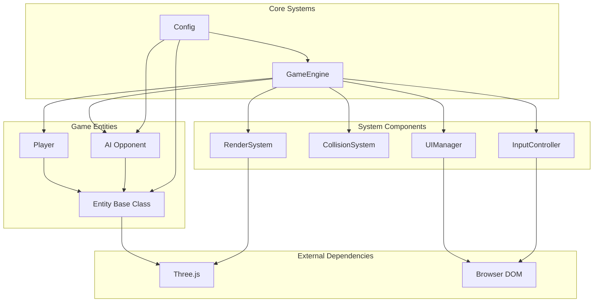
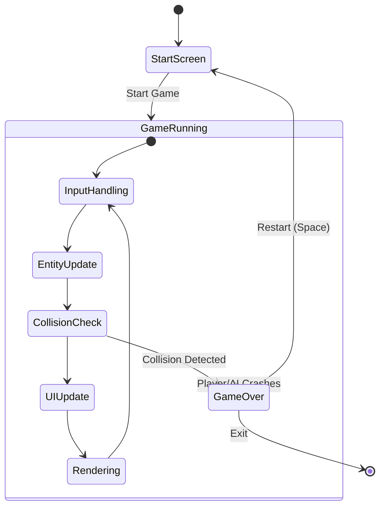
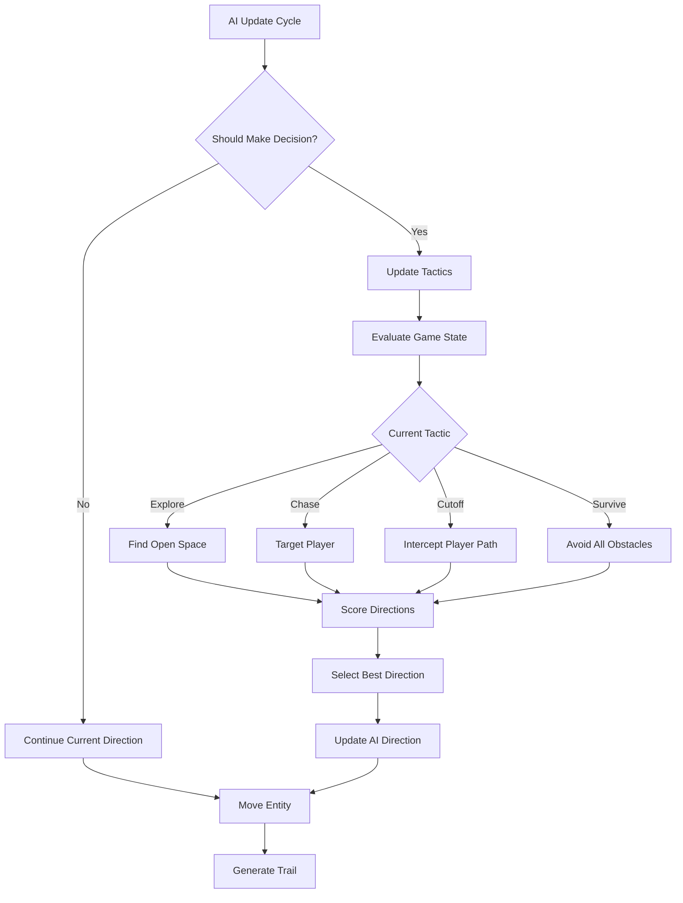

# Tron3D

A 3D third-person Tron light cycles game that runs in a web browser. Built with Three.js for 3D graphics rendering and modern ES6 modules.

## 🎮 Features

- **3D Third-Person Gameplay**: Immersive perspective with dynamic camera following
- **Player vs AI Opponent**: Intelligent AI with multiple personality types and tactics
- **Light Trail System**: Dynamic trail generation that creates collision hazards
- **Power-Up System**: Speed boosts and visual effects
- **Neon-Styled Visuals**: Authentic Tron aesthetic with emissive materials
- **Minimap Display**: Real-time tactical overview
- **Cross-Platform Controls**: Keyboard and touch support for desktop and mobile
- **Progressive Difficulty**: AI adapts and becomes more challenging over time

## 🏗️ System Architecture



## 🔄 Game Flow



## 🎯 AI Decision System



## 🚀 Quick Start

### Prerequisites
- Node.js 16+ 
- Modern web browser with WebGL support

### Installation & Setup

```bash
# Clone the repository
git clone <repository-url>
cd tron3d

# Install dependencies
npm install

# Start development server
npm run dev
```

Open your browser to `http://localhost:3000`

## 🎮 Game Controls

| Input | Action |
|-------|--------|
| **Arrow Left** / **A** | Turn left |
| **Arrow Right** / **D** | Turn right |
| **Space** | Restart after game over |
| **Swipe Left/Right** | Turn (mobile) |

## 🧪 Development & Testing

### Code Quality Standards
- **ESLint**: Zero linting errors enforced
- **Test Coverage**: Comprehensive unit and integration tests
- **Architecture**: Modular, class-based design with clear separation of concerns

### Available Commands

```bash
# Development
npm run dev          # Start development server (port 3000)
npm run build        # Build for production

# Testing & Quality
npm test             # Run all tests
npm run lint         # Check code quality with ESLint

# Test Coverage Summary
# - 9 test suites covering all major components
# - 66+ test cases for comprehensive coverage
# - Integration and unit tests included
```

### Test Coverage

| Component | Test File | Coverage |
|-----------|-----------|----------|
| Game Entities | `Entity.test.js`, `Player.test.js`, `AI.test.js` | ✅ Core functionality |
| Game Systems | `CollisionSystem.test.js`, `RenderSystem.test.js` | ✅ System interactions |
| UI & Input | `UIManager.test.js`, `InputController.test.js` | ✅ User interactions |
| Game Logic | `GameEngine.test.js`, `TrailCollision.test.js` | ✅ Game mechanics |

## 📁 Project Structure

```
tron3d/
├── src/                    # Source code
│   ├── index.html         # Main HTML entry point
│   └── js/
│       ├── core/          # Core game engine
│       │   └── GameEngine.js
│       ├── entities/      # Game objects
│       │   ├── Entity.js     # Base entity class
│       │   ├── Player.js     # Player-controlled cycle
│       │   └── AI.js         # AI opponent
│       ├── systems/       # Game systems
│       │   ├── CollisionSystem.js
│       │   ├── RenderSystem.js
│       │   ├── InputController.js
│       │   └── UIManager.js
│       ├── utils/         # Configuration & utilities
│       │   └── Config.js
│       └── main.js        # Application entry point
├── tests/                 # Comprehensive test suite
│   ├── *.test.js         # Test files for each component
│   ├── mockThree.js      # Three.js mocking utilities
│   └── setup.js          # Test configuration
├── .eslintrc.json        # ESLint configuration
├── babel.config.cjs      # Babel transpilation config
├── jest.config.cjs       # Jest testing framework config
├── package.json          # Dependencies and scripts
├── CLAUDE.md            # Development guidance
└── README.md            # This file
```

## 🔧 Technical Implementation

### Core Technologies
- **Three.js**: 3D graphics rendering and WebGL abstraction
- **ES6 Modules**: Modern JavaScript module system
- **Jest**: Testing framework with comprehensive mocking
- **ESLint**: Code quality and style enforcement
- **Babel**: JavaScript transpilation for compatibility

### Performance Optimizations
- **Trail Management**: Automatic cleanup of old trail segments
- **Frame-based Updates**: Optimized update frequency for different systems
- **Camera Smoothing**: Interpolated camera movement for fluid gameplay
- **Particle Systems**: Efficient explosion effects with resource cleanup

### AI Intelligence Features
- **Multi-personality System**: Cautious, Balanced, and Aggressive AI types
- **Dynamic Tactics**: Real-time strategy switching (Explore, Chase, Cutoff, Survive)
- **Adaptive Difficulty**: Progressive speed and intelligence increases
- **Spatial Awareness**: Advanced pathfinding with look-ahead collision detection

## 🔮 Roadmap & Future Enhancements

### Planned Features
- **Multiplayer Mode**: Online and local multiplayer support
- **Custom Arena Designer**: User-created tracks and obstacles
- **Enhanced AI**: Machine learning-based opponents
- **Leaderboard System**: Score tracking and competition
- **Visual Effects**: Advanced particle systems and post-processing
- **Sound Design**: Dynamic audio and music system
- **Mobile Optimization**: Enhanced touch controls and responsive design

### Technical Improvements
- **WebRTC Integration**: Real-time multiplayer networking
- **WebAssembly**: Performance-critical AI calculations
- **Progressive Web App**: Offline capability and app-like experience
- **TypeScript Migration**: Enhanced type safety and developer experience

## 📄 License

MIT License - See LICENSE file for details

## 🤝 Contributing

1. Fork the repository
2. Create a feature branch (`git checkout -b feature/amazing-feature`)
3. Run tests (`npm test`) and linting (`npm run lint`)
4. Commit your changes (`git commit -m 'Add amazing feature'`)
5. Push to the branch (`git push origin feature/amazing-feature`)
6. Open a Pull Request

---

*Built with ❤️ using Three.js and modern web technologies*